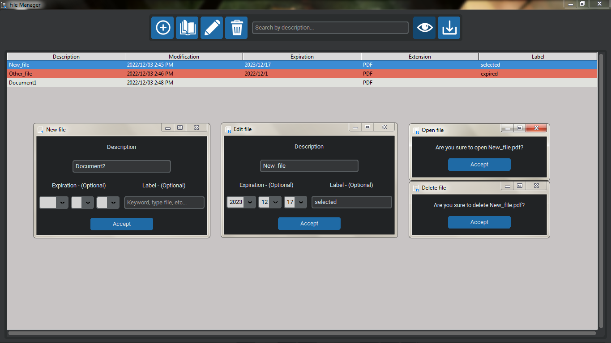

# File manager using Python, CustomTkinter and SQLite

Desktop application that handles the management of documents in digital format, thanks to the implementation of a user-friendly interface that allows the automation of CRUD instructions on a relational database.

 

## How to use

**1). Create a virtual environment:**
* `python -m venv env`

**2). Install the necessary packages:**
* `pip install -r requirements.txt`

**3). Run:**
* `python run.py` or `python -m filemanager`

 

## Preview

    <picture>
        
    </picture>
    <picture>
        
    </picture>

